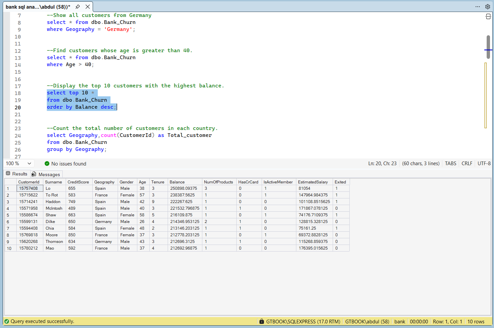
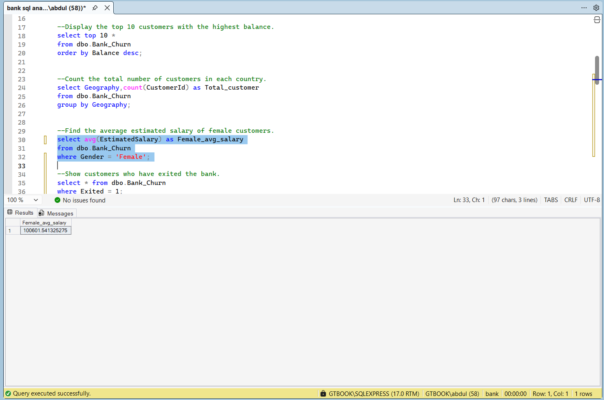
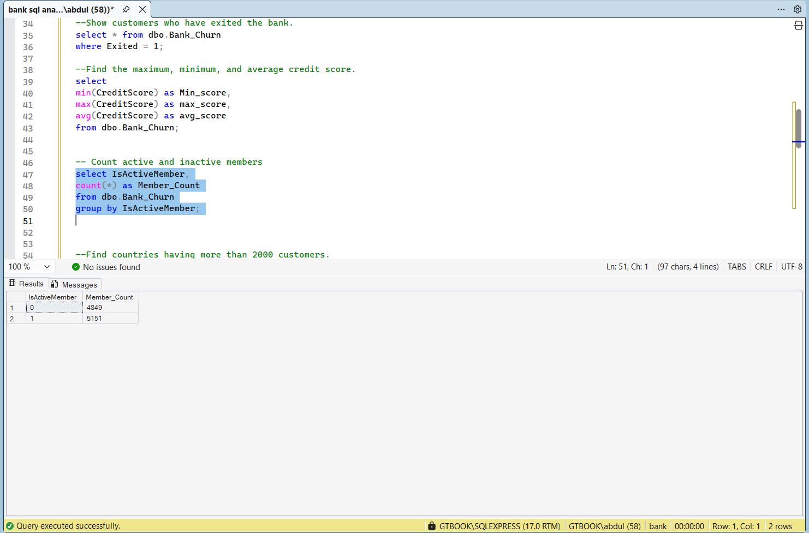

# 📊 Bank Customer Churn SQL Analysis

A beginner-to-intermediate SQL project analyzing a Bank Customer Churn dataset using SQL Server Management Studio (SSMS).

---

## 🚀 Project Overview

This project focuses on solving real-world business questions using SQL queries.  
It demonstrates data filtering, aggregation, grouping, sorting, and subqueries on customer banking data.

---

## 🛠️ Tools Used

- SQL Server Management Studio (SSMS)
- Microsoft SQL Server
- GitHub

---

## 📂 Dataset

**Bank Customer Churn Dataset**

The dataset contains customer information such as:
- Credit score
- Geography
- Gender
- Age
- Balance
- Estimated salary
- Active membership
- Credit card status
- Customer churn status

---

## 📘 SQL Concepts Covered

- `SELECT`
- `WHERE`
- `ORDER BY`
- `GROUP BY`
- `HAVING`
- Aggregate Functions
- Subqueries
- Data Filtering
- Business Insight Queries

---

## ❓ Business Questions Solved

1. Find customers whose age is greater than 40  
2. Display top 10 customers with highest balance  
3. Count total customers in each country  
4. Find average salary of female customers  
5. Show customers who exited the bank  
6. Find maximum, minimum, and average credit score  
7. Count active and inactive members  
8. Find countries having more than 2000 customers  
9. Display customers whose balance is greater than average balance  
10. Find customers with both credit card and active membership  
11. Find second highest estimated salary  

---

## 📁 Project Structure

```text
Bank-Customer-Churn-SQL-Project/
│
├── dataset/
├── queries/
├── screenshots/
│   ├── female_avg_salary.png
│   ├── top_10_highest_balance.png
│   ├── second_highest_salary.png
│   ├── countries_more_than_2000_customers.png
│   ├── active_vs_inactive_members.png
│   └── customers_by_country.png
│
└── README.md
```
📸 Screenshots
Top 10 Customers with Highest Balance


Female Average Salary


Active vs Inactive Members


🎯 Key Learnings
Writing SQL queries
Aggregate calculations
Data filtering and sorting
Business problem solving with SQL
Working with real-world datasets


## 🔗 GitHub Repository
https://github.com/yourusername/netflix-excel-dashboard

---

## 👤 Author
**A Afran**
